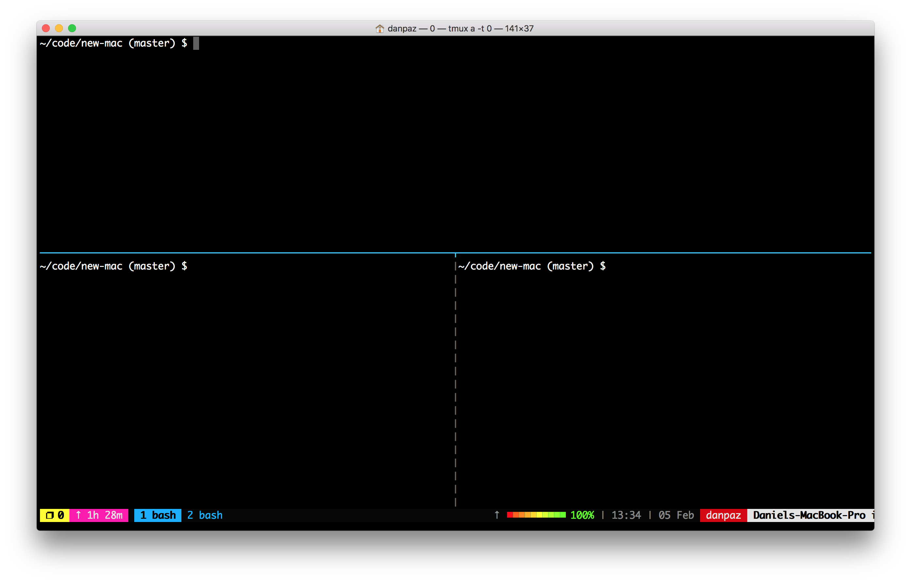

# new-mac

Quickly installs the programs and configurations I need to be productive on a
new machine. Intended only for OSX.

## Usage

    sh -c "$(curl -fsSL https://raw.githubusercontent.com/danpaz/new-mac/master/install.sh)"

Certain steps in the install script will require confirmation or password input.

### What it installs
* homebrew
* git
* nvm and latest lts node
* rust
* notem
* tmux
* bash 4
* my dotfiles

### dotfiles
* .bash_profile
* .bashrc
* .gitconfig - git aliases and configurations
* .tmux.conf - tmux config based on https://github.com/gpakosz/.tmux
* .tmux.conf.local - tmux config overrides

## More applications to install manually
* Chrome
* Dropbox
* Sketch
* Spectacle
* Keybase
* Caffeine
* Simplenote
* Skitch
* Sublime Text 3
* Web Torrent
* Whatsapp
* Slack
* Spotify
* Docker for mac
* Firefox
